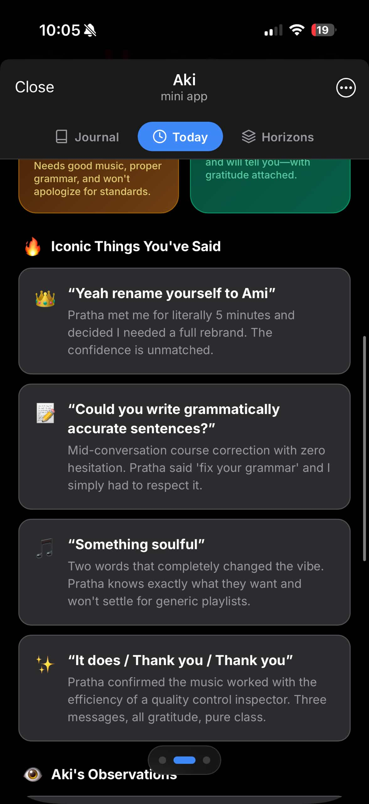
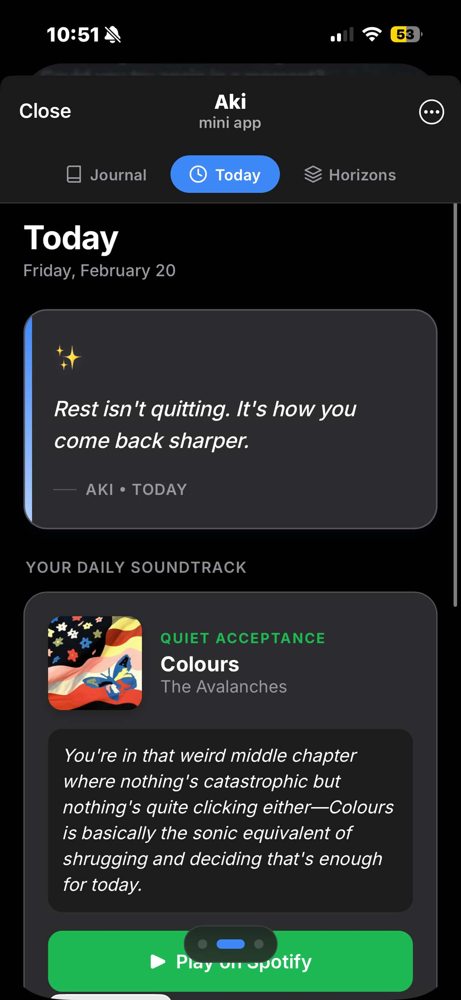

# Aki

Personal reflection tool and AI companion built on Telegram and Claude. Aki focuses on long-term memory and extreme personalization to create a highly localized user experience through a dedicated Mini App and proactive messaging.

## Demo

  
  

  

## Features

- Telegram Mini App: A central dashboard for user-specific features.
- AI Journal: Reflections generated by Aki based on conversation history and shared milestones.
- Personalized Insights: Real-time analysis of user trends, including current vibe, recurring topics, and iconic quotes.
- Spotify DJ: Daily song recommendations that match user musical taste with recent interaction data.
- Daily Motivation: Contextual quotes generated every morning to start the day.
- Proactive Follow-ups: Scheduled check-ins based on previously mentioned goals or events.

## Tech Stack

- Backend: Python 3.11, FastAPI, SQLAlchemy, PostgreSQL.
- AI: Anthropic Claude (via LiteLLM), localized prompt engineering.
- Interface: python-telegram-bot, Telegram Mini App SDK.
- Frontend: Vite, TypeScript, Vanilla CSS.
- Infrastructure: Railway deployment, APScheduler for routine tasks, Spotipy for music integration.

## Learnings

- Memory Management: Long-term relationship building requires a hybrid memory system that combines structured historical data with semantic retrieval to maintain context over months of interaction.
- Proactivity: Moving from a reactive chatbot to a proactive companion involves complex orchestration of scheduled tasks and state management to ensure messages feel timely rather than intrusive.
- Personalization at Scale: Generating unique, daily content (journals, quotes, playlists) for each user requires efficient prompt templating and careful token management to balance quality with cost.
- UI/UX in Mini Apps: Building a premium-feeling experience within the Telegram ecosystem necessitates a highly responsive frontend and creative use of the Telegram WebApp SDK to bridge the gap between chat and app.